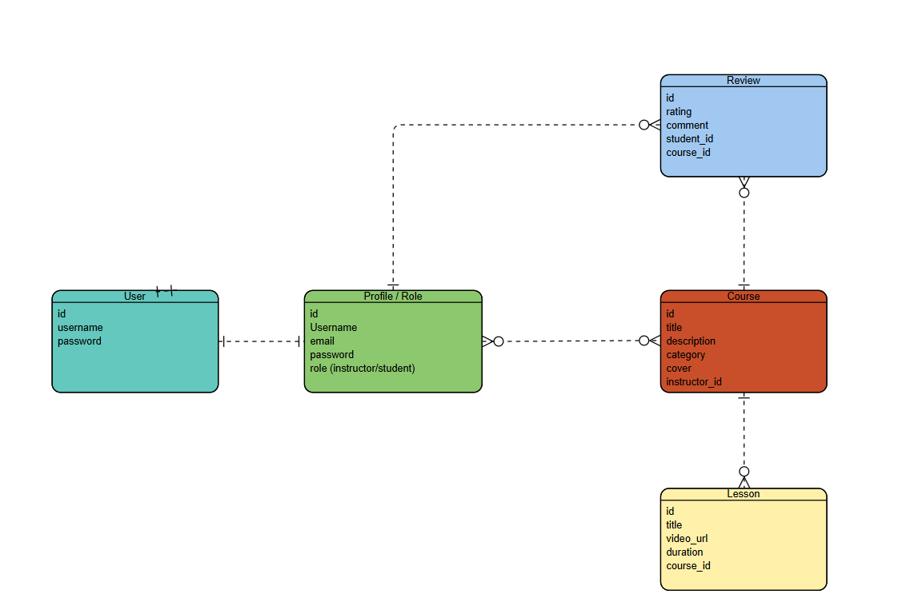

## Learning Management System
**Project Description:**
<p>The Learning Management System (LMS) backend is built using Django REST Framework to manage courses, lessons, and users efficiently.
    
It provides secure RESTful APIs for authentication, content management, and communication between instructors and students.

This backend serves as the core of the LMS, connecting to a PostgreSQL database and integrating seamlessly with the React frontend.</p>

## Repository Description
This repository contains the backend code for the LMS project, including:

- Django project configuration and settings.

- REST API endpoints for managing users, courses, and lessons.

- PostgreSQL database models.

- Docker setup for easy deployment and local development.

## Tech Stack
<table border="1" width="100%">
    <thead>
        <tr>
            <th width="6%">Technology</th>
            <th width="55%">Purpose</th>
        </tr>
    </thead>
    <tbody>
        <tr><td>Python</td><td>Primary backend programming language.</td>
        <tr><td>Django</td><td>Web framework providing MVC architecture.</td>
        <tr><td>Django REST Framework</td><td>For creating RESTful API endpoints.</td>
        <tr><td>PostgreSQL</td><td>Relational database for secure and structured data storage.
        </td>
        <tr><td>CORS Headers</td><td>To enable frontend-backend communication.</td>
    </tbody>
</table>

### Frontend Repository 

[Frontend](https://github.com/Ahmed-Hattan-2285/LMS-frontend).

### Deployed Site

[Live Demo](http://localhost:8000/).

### ERD diagram
Here’s the Entity Relationship Diagram (ERD) representing the database structure:



### Installation & Setup (Using Docker)

**1. Clone the Repository**
```
git clone https://github.com/yourusername/lms-backend.git
cd lms-backend
```

**2. Create .env file**
```
DEBUG=True
SECRET_KEY=your-secret-key
DATABASE_URL=postgres://postgres:password@db:5432/lms_db
ALLOWED_HOSTS=*
```

**3. Build & Run with Docker**
```
docker compose up --build
```

## RESTful Routing for LMS

<h2>Users</h2>
<table border="1" width="100%">
    <thead>
        <tr>
            <th width="15%">Entity</th>
            <th width="25%">HTTP Method</th>
            <th width="25%">Endpoint</th>
            <th width="20%">CRUD</th>
            <th width="50%">Description</th>
        </tr>
    </thead>
    <tbody>
        <tr><td>Users</td><td>POST</td><td>/Users/register/</td><td>Create</td><td>Register a new user account</td></tr>
        <tr><td>Users</td><td>POST</td><td>/users/login/</td><td>Read</td><td>Authenticate and log in a user</td></tr>
        <tr><td>Users</td><td>POST</td><td>users/verify/</td><td>Read</td><td>Verify user credentials or email</td></tr>
    </tbody>
</table>

<h2>Courses</h2>
<table border="1" width="100%">
    <thead>
        <tr>
            <th width="15%">Entity</th>
            <th width="25%">HTTP Method</th>
            <th width="25%">Endpoint</th>
            <th width="20%">CRUD</th>
            <th width="50%">Description</th>
        </tr>
    </thead>
    <tbody>
        <tr><td>Courses</td><td>GET</td><td>/courses/</td><td>Read</td><td>Get all courses</td></tr>
        <tr><td>Courses</td><td>POST</td><td>/courses/</td><td>Create</td><td>Create new course</td></tr>
        <tr><td>Courses</td><td>POST</td><td>/courses/cover</td><td>Create</td><td>Create a Cover Course</td></tr>
        <tr><td>Courses</td><td>GET</td><td>/courses/{id}</td><td>Read</td><td>Get one course by ID</td></tr>
        <tr><td>Courses</td><td>PUT</td><td>/courses/{id}/</td><td>Update</td><td>Update course info</td></tr>
        <tr><td>Courses</td><td>DELETE</td><td>/courses/{id}/</td><td>Delete</td><td>Delete a course</td></tr>
    </tbody>
</table>

<h2>lessons</h2>
<table border="1" width="100%">
    <thead>
        <tr>
            <th width="15%">Entity</th>
            <th width="25%">HTTP Method</th>
            <th width="25%">Endpoint</th>
            <th width="20%">CRUD</th>
            <th width="50%">Description</th>
        </tr>
    </thead>
    <tbody>
        <tr><td>lessons</td><td>GET</td><td>/lessons/</td><td>Read</td><td>Get all lessons</td></tr>
        <tr><td>lessons</td><td>POST</td><td>/lessons/</td><td>Create</td><td>Create new lesson</td></tr>
        <tr><td>lessons</td><td>GET</td><td>/lessons/{id}</td><td>Read</td><td>Get one lesson by ID</td></tr>
        <tr><td>lessons</td><td>PUT</td><td>/lessons/{id}/</td><td>Update</td><td>Update lesson info</td></tr>
        <tr><td>lessons</td><td>DELETE</td><td>/lessons/{id}/</td><td>Delete</td><td>Delete a lesson</td></tr>
    </tbody>
</table>

<h2>reviews</h2>
<table border="1" width="100%">
    <thead>
        <tr>
            <th width="15%">Entity</th>
            <th width="25%">HTTP Method</th>
            <th width="25%">Endpoint</th>
            <th width="20%">CRUD</th>
            <th width="50%">Description</th>
        </tr>
    </thead>
    <tbody>
        <tr><td>reviews</td><td>GET</td><td>/reviews/</td><td>Read</td><td>Get all reviews</td></tr>
        <tr><td>reviews</td><td>POST</td><td>/reviews/</td><td>Create</td><td>Create new review</td></tr>
        <tr><td>reviews</td><td>PUT</td><td>/reviews/{id}/</td><td>Update</td><td>Update review info</td></tr>
        <tr><td>reviews</td><td>DELETE</td><td>/reviews/{id}/</td><td>Delete</td><td>Delete a review</td></tr>
    </tbody>
</table>

### IceBox Features
- **Admin Analytics Dashboard** – Monitor active users, course popularity, and engagement statistics.

- **Email Notifications** – Send automatic emails for new enrollments or password resets.

- **Payment Integration** – Allow students to pay for premium courses using credit card or PayPal.

- **AI Course Recommendation** – Suggest related courses based on learning history.
